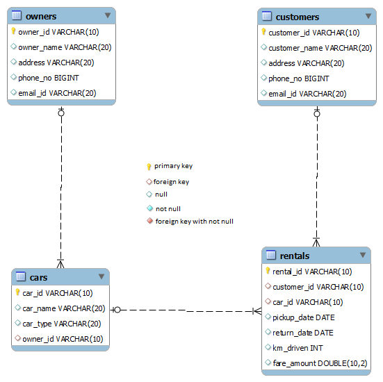

# Car & Owner Details Based on Car Type

Write a query to display the car id, car name, and owner id of all the cars whose car type is 'Hatchback' or 'SUV'. Sort the result based on car id.

(Hint: Use the `CARS` table to retrieve records. Data is case-sensitive. For example, `Car_type='Hatchback'`. Use the IN operator.)

**NOTE:** Maintain the same sequence of column order, as specified in the question description.

**Solution - **

`SELECT car_id, car_name, owner_id FROM carsWHERE car_type IN ('Hatchback', 'SUV')ORDER BY car_id;`
