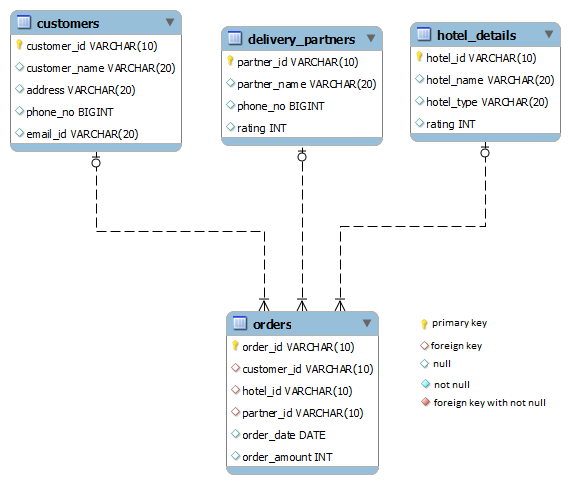

# Delivery Partner Details Based on Rating

Write a query to display the partner id, partner name, and phone number of delivery partners whose rating is between 3 to 5, sorted by partner id.

(Hint: Use the `Delivery_partners` table to retrieve records.)

**NOTE:** Maintain the same sequence of column order, as specified in the question description.

**Solution - **

`sql
SELECT partner_id, partner_name, phone_no
FROM Delivery_partners
WHERE rating BETWEEN 3 AND 5
ORDER BY partner_id;`
