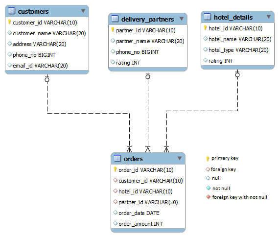

# Hotels that took order based on month

Write a query to display distinct hotel id, hotel name, and rating of hotels that have taken order in the month of July. Sort the result based on hotel id in ascending order.

(HINT: Use Hotel_details and  Orders tables to retrieve records.Order date='2019-07-14'.)

NOTE: Maintain the same sequence of column order, as specified in the question description

**Solution - **

`SELECT DISTINCT h.hotel_id, h.hotel_name, h.rating FROM hotel_details h
JOIN orders o ON h.hotel_id = o.hotel_id
WHERE MONTH(o.order_date) = 7
ORDER BY h.hotel_id;`