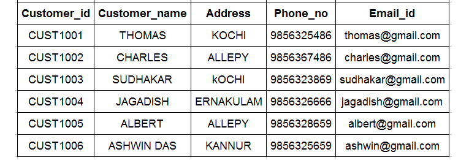

# Hunger Eats - Update Table

Refer to the given schema diagram and sample records inserted into the **Customers** table.

Update records based on the given requirement.

**Requirement 1**: Update the phone number of the **Customers** whose id is 'CUST1004' to the new phone number '9876543210'.

**NOTE**: Maintain the same sequence of column order, as specified in the question description.

**Solution - **

`UPDATE customersSET phone_no = 9876543210WHERE customer_id = "CUST1004";`