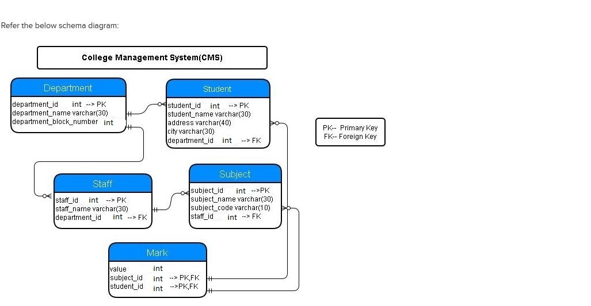

## Insert Records - Department

Insert the following records into the `department` table:

| Department_id | Department_name | department_block_number |
|---------------|------------------|-------------------------|
| 1             | CSE              | 3                       |
| 2             | IT               | 3                       |
| 3             | SE               | 3                       |

**NOTE:** Maintain the same sequence of column order, as specified in the question description.

**Solution - **

`INSERT INTO Department(Department_id, Department_name, department_block_number)
VALUES (1, "CSE", 3), (2, "IT", 3), (3, "SE", 3);`