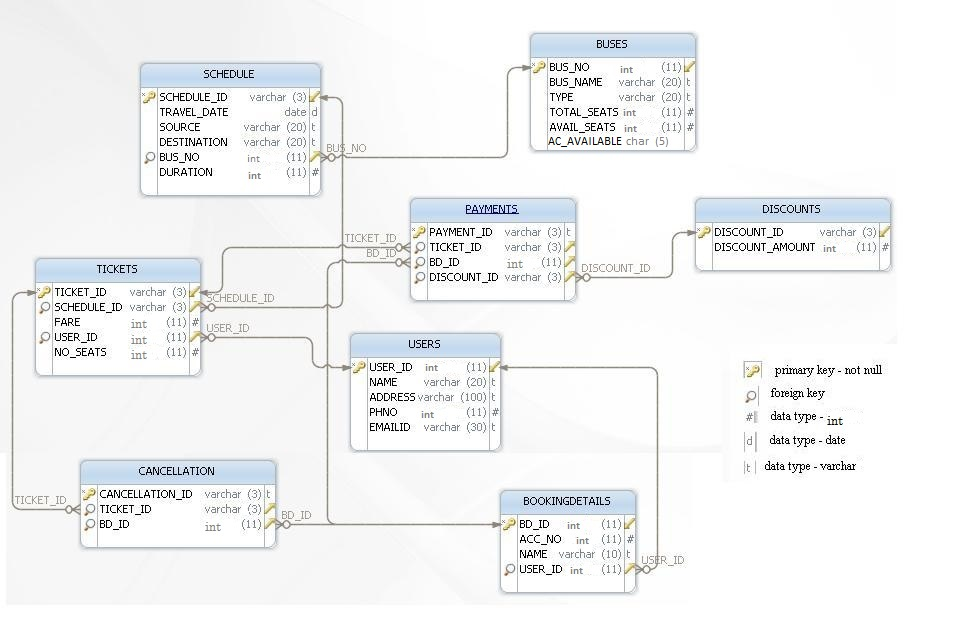

# Password Generation

Write a query to display the user name and password. Password should be generated by concatenating the first three characters of the user name and the first three numbers of the phone number attribute. Give an alias name as PASSWORD. Sort the result based on the user name.

**Note**: Evaluate only the respective query to get the desired result.

Maintain the same sequence of column order as given in the problem description.

**Solution - **

`SELECT name, CONCAT(SUBSTR(name, 1, 3), SUBSTR(PHNO, 1, 3)) AS Password FROM USERS ORDER BY name;`