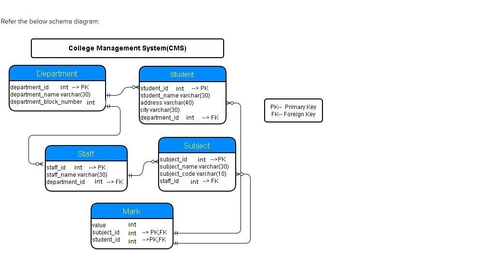

# Student and their Department Based on City

Write a query to display list of students name and their department name who are all from 'Coimbatore'. Sort the result based on students name.

**NOTE**: Maintain the same sequence of column order, as specified in the question description

**Solution - **

`SELECT s.student_name, d.department_name FROM Student sJOIN Department d ON s.department_id = d.department_idWHERE s.city = 'Coimbatore'ORDER BY s.student_name;`