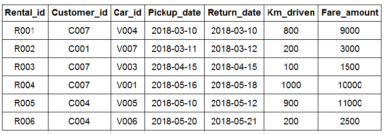

# Car Rental System - Insert Values

Refer to the given schema diagram. Insert the below records into the **Rentals** Table. Assume the rentals table has been already created.

**Note**: Letters in bold represent the attributes.

**NOTE**: Maintain the same sequence of column order, as specified in the question description.

**Solution - **

`INSERT INTO rentalsVALUES ("R001", "C007", "V004", "2018-03-10", "2018-03-10", 800, 9000), ("R002", "C001", "V007", "2018-03-11", "2018-03-12", 200, 3000), ("R003", "C007", "V003", "2018-04-15", "2018-04-15", 100, 1500), ("R004", "C007", "V001", "2018-05-16", "2018-05-18", 1000, 10000), ("R005", "C004", "V005", "2018-05-10", "2018-05-12", 900, 11000), ("R006", "C004", "V006", "2018-05-20", "2018-05-21", 200, 2500);`